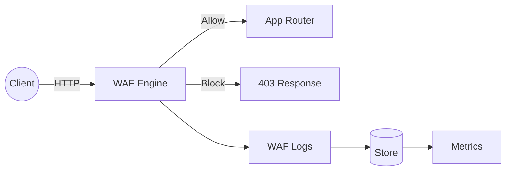
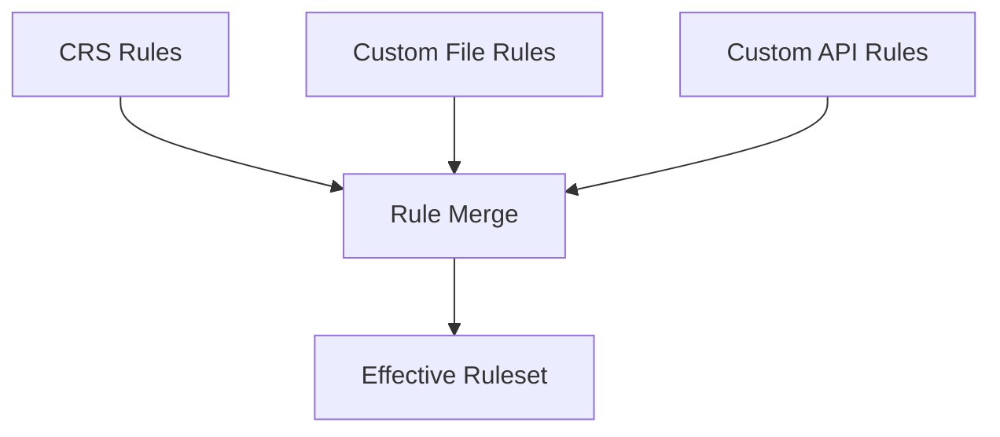

# Obsidian Sentinel WAF — Viva Explanation (Final‑Year)

## 1) What this system is
Obsidian Sentinel is an **enterprise‑style Web Application Firewall (WAF)** built on the Coraza engine (ModSecurity‑compatible). It protects HTTP services by inspecting requests and responses, applying rules, and emitting security telemetry.

**One‑line thesis:** *“Detect and block web attacks at the HTTP layer while preserving auditability, observability, and low‑latency request handling.”*

---

## 2) High‑level architecture (control plane vs data plane)

- **Data plane (hot path):** Request → WAF rules → allow/block → response. This must be fast and allocation‑light.
- **Control plane (non‑hot path):** Rule CRUD, CRS management, audit logs, metrics, admin APIs.

---

## 3) Request lifecycle (why it’s secure)

1. **Request ID** assigned for traceability.
2. **Security headers** added for baseline hardening.
3. **IP allowlist** enforced for admin endpoints.
4. **Rate limiting** applied (Redis if available).
5. **GeoIP checks** (optional).
6. **WAF evaluation** using Coraza rules.
7. **Logging + metrics** emitted.

This layering prevents single‑point failure and mirrors enterprise WAF designs.

---

## 4) Rule management model (defensible design)

Rules are treated as **immutable once compiled** and are categorized by provenance:

- **Custom rules** (editable) → ID range **900000–909999**
- **CRS rules** (read‑only) → ID range **940000–959999**

**Effective rule resolution order:**
1. CRS rules
2. Custom rules from file
3. Custom rules created via API

Why this matters:
- **CRS remains immutable** (auditor requirement).
- **Custom changes are auditable** (rule audit log).
- **Deterministic override order** prevents ambiguity.

---

## 5) Observability & auditability (enterprise expectations)

- **Audit logging:** all custom rule create/update/delete operations are recorded.
- **CRS status endpoint:** exposes enabled state, version, fingerprint, counts, last load time.
- **Metrics:** rule hits, block vs alert ratios, top offenders.

This makes the WAF *defensible* under review and supports SOC workflows.

---

## 6) Security model & trust boundaries

- **Untrusted inputs:** all headers, body, query, cookies, and IP data.
- **Trusted components:** WAF engine, store, and audit pipelines.
- **Boundaries:**
  - External HTTP traffic ↔ WAF
  - Admin APIs ↔ authenticated RBAC boundary
  - Persistence ↔ database credentials

Threats mitigated:
- SQLi, XSS, LFI, RCE, SSRF, XXE, template injection.
- Bot/scanner detection.
- Credential leakage in URLs.

---

## 7) Why this is not “just a student project”

- **Evidence of security discipline:** RBAC, immutable CRS, audit trails.
- **Operational maturity:** CRS visibility, metrics, and status endpoints.
- **Performance awareness:** hot‑path isolation and no DB calls inside request processing.

---

## 8) If asked: “What would you improve next?”

1. **CRS fingerprint validation** against expected version.
2. **CRS hot‑reload** with admin audit trail.
3. **Paranoia level support** with staged rollout.

---

## 9) Short viva summary (30‑second answer)

“Obsidian is a Coraza‑based WAF that enforces layered request inspection, immutable CRS rules, and auditable custom rules. The data plane stays minimal for low latency, while the control plane provides admin APIs, metrics, and audit logging. This separation makes it secure, observable, and reviewable—consistent with enterprise WAF design.”
